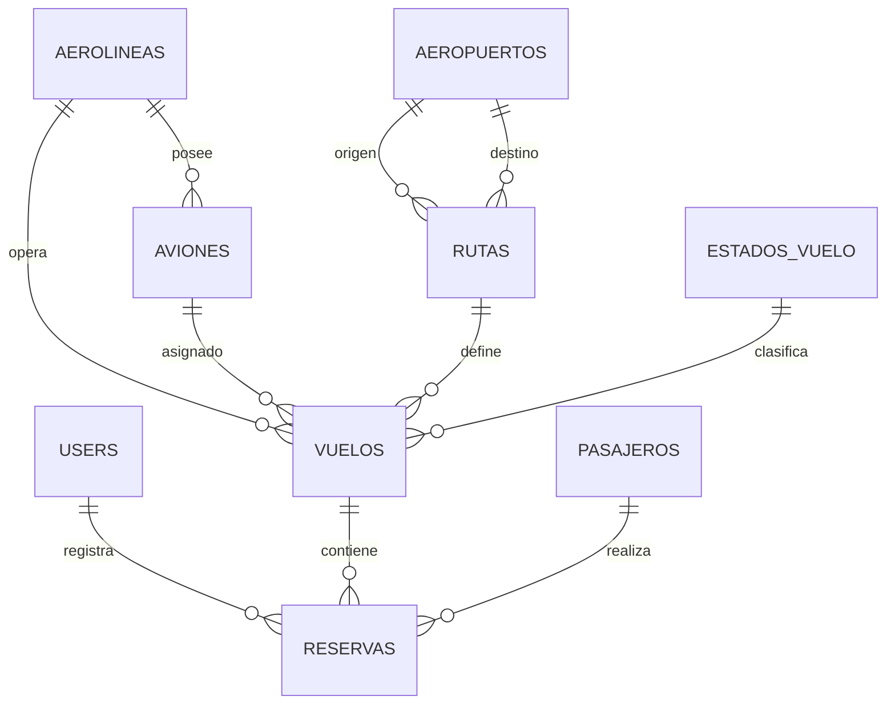

# AeroLink - Diseno de Base de Datos

## 1. Enfoque general

La base de datos fue planteada para representar una operacion aerea academica pero creible. Se priorizo una estructura relacional clara, con tablas faciles de defender y relaciones que respondan al flujo principal del sistema:

`aerolinea -> avion -> ruta -> vuelo -> reserva -> dashboard`

Tambien se incorporan aeropuertos, pasajeros y estados de vuelo para darle consistencia al dominio.

## 2. Entidades principales

### `users`

Tabla propia de Laravel para usuarios del sistema. Se conserva para futuras acciones administrativas, autenticacion simple y trazabilidad.

### `aerolineas`

Representa a la empresa operadora. En este proyecto se mantiene porque la base existente ya trabajaba con esta entidad y ayuda a que el sistema se vea mas real.

Campos clave:

- nombre
- codigo_iata
- pais
- telefono
- email
- activa

### `aeropuertos`

Catalogo de terminales aereas de origen y destino.

Campos clave:

- nombre
- codigo_iata
- codigo_icao
- ciudad
- pais
- latitud
- longitud

### `aviones`

Flota disponible para operar vuelos.

Campos clave:

- aerolinea_id
- matricula
- modelo
- fabricante
- capacidad
- alcance_km
- estado
- ultimo_mantenimiento

### `rutas`

Define el trayecto entre dos aeropuertos.

Campos clave:

- codigo
- aeropuerto_origen_id
- aeropuerto_destino_id
- distancia_km
- duracion_minutos
- tarifa_base
- activa

### `estados_vuelo`

Catalogo de estados operativos usados por el sistema.

Estados sugeridos:

- Programado
- Embarcando
- En vuelo
- Demorado
- Aterrizado
- Cancelado

### `vuelos`

Operacion programada en una fecha y hora concreta.

Campos clave:

- aerolinea_id
- avion_id
- ruta_id
- estado_vuelo_id
- codigo_vuelo
- fecha_salida
- fecha_llegada
- terminal
- puerta_embarque
- capacidad
- precio_base

### `pasajeros`

Registro de clientes o viajeros del sistema.

Campos clave:

- nombres
- apellidos
- tipo_documento
- numero_documento
- fecha_nacimiento
- nacionalidad
- telefono
- email

### `reservas`

Relaciona al pasajero con el vuelo.

Campos clave:

- vuelo_id
- pasajero_id
- user_id
- codigo_reserva
- fecha_reserva
- asiento
- clase
- estado
- precio_total
- equipaje_registrado

## 3. Relaciones principales

- Una `aerolinea` tiene muchos `aviones`.
- Una `aerolinea` tiene muchos `vuelos`.
- Un `avion` pertenece a una `aerolinea`.
- Una `ruta` pertenece a un `aeropuerto` origen y a un `aeropuerto` destino.
- Una `ruta` tiene muchos `vuelos`.
- Un `vuelo` pertenece a una `ruta`.
- Un `vuelo` pertenece a un `avion`.
- Un `vuelo` pertenece a un `estado_vuelo`.
- Un `vuelo` tiene muchas `reservas`.
- Un `pasajero` tiene muchas `reservas`.
- Una `reserva` pertenece a un `pasajero`.
- Una `reserva` pertenece a un `vuelo`.
- Una `reserva` puede pertenecer a un `user` que la registro.

## 4. Diagrama logico explicado

Explicacion del flujo:

- Primero se registra la aerolinea y su flota.
- Luego se registran aeropuertos y se crean rutas.
- Cada vuelo necesita una ruta, un avion y un estado.
- Los pasajeros no dependen directamente del vuelo; se conectan por medio de la reserva.
- El dashboard podra contar vuelos por estado, reservas por clase, ocupacion por vuelo y distribucion de rutas.

## 5. Decisiones de diseno

### Por que existe `reservas` y no una relacion directa entre `pasajeros` y `vuelos`

Porque la reserva guarda datos operativos propios:

- codigo de reserva
- asiento
- clase
- estado
- precio total

Eso la convierte en una entidad intermedia con informacion de negocio.

### Por que `estado_vuelo` esta en una tabla separada

Porque permite:

- reutilizar el catalogo en todo el sistema
- mostrar colores y etiquetas en frontend
- contar vuelos por estado en dashboard
- evitar cadenas de texto repetidas en cada fila de vuelo

### Por que `aerolinea_id` se guarda tambien en `vuelos`

Aunque el avion ya apunta a una aerolinea, mantener la referencia directa en el vuelo simplifica consultas, filtros y reportes academicos, y ademas conserva coherencia con la base previa del proyecto.

## 6. Integridad y consistencia

Se aplicaron estas reglas:

- Codigos unicos para vuelo, reserva, aeropuerto y matricula.
- Llaves foraneas para asegurar relaciones validas.
- Soft deletes en tablas operativas para no perder historial logico.
- Indices para filtros comunes en vuelos y reservas.

## 7. Migraciones creadas

Se reemplazo la migracion general anterior por un conjunto de migraciones mas limpias:

- `create_aerolineas_table`
- `create_aeropuertos_table`
- `create_aviones_table`
- `create_rutas_table`
- `create_estados_vuelo_table`
- `create_vuelos_table`
- `create_pasajeros_table`
- `create_reservas_table`

## 8. Seeders incluidos

Se agregaron seeders base para dejar datos realistas de prueba:

- `EstadoVueloSeeder`
- `DatosDemoSeeder`

Esto permitira mostrar dashboard y tablas con datos consistentes desde las siguientes fases.

## 9. Archivos clave de esta fase

- `database/migrations/2026_03_30_000001_create_aerolineas_table.php`
- `database/migrations/2026_03_30_000002_create_aeropuertos_table.php`
- `database/migrations/2026_03_30_000003_create_aviones_table.php`
- `database/migrations/2026_03_30_000004_create_rutas_table.php`
- `database/migrations/2026_03_30_000005_create_estados_vuelo_table.php`
- `database/migrations/2026_03_30_000006_create_vuelos_table.php`
- `database/migrations/2026_03_30_000007_create_pasajeros_table.php`
- `database/migrations/2026_03_30_000008_create_reservas_table.php`
- `database/seeders/EstadoVueloSeeder.php`
- `database/seeders/DatosDemoSeeder.php`

## 10. Siguiente fase

La siguiente entrega sera el backend Laravel:

- modelos
- relaciones Eloquent
- controladores API
- rutas REST
- validaciones
- respuestas JSON
